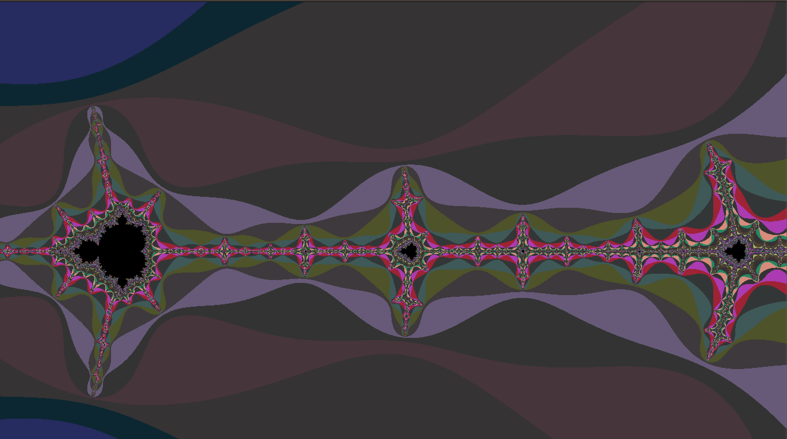
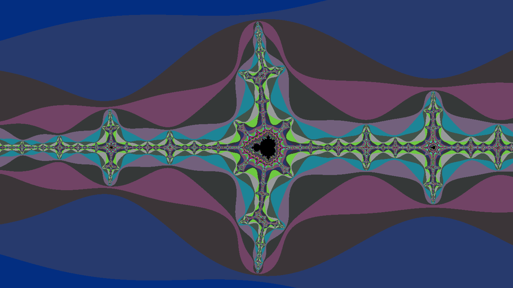

# Fractals are wonderful

"fractal, in mathematics, any of a class of complex geometric shapes that commonly have “fractional dimension,”"

### How to run it:

- `git clone`
- `make`
- `./fractol m`

You can also press H while the app is running to get a detailed info about all controls you can use.

### Render options:

- `./fractol m` Renders Mandelbrot
- `./fractrol j` Renders Julia, You can also add custom julia params by passing it `./fractol j <REAL> <IMAGINARY>`
- `./fractrol t` Renders Multibrot, which can be used to generate any custom power to the Z.

### Controls:

- R (increase) or CNTRL + R (decrease) ::                 Controls Red shift
- G (increase) or CNTRL + G (decrease) ::                 Controls Green shift
- B (increase) or CNTRL + B (decrease) ::                 Controls Blue shift
- A (increase) or CNTRL + A (decrease) ::                 Controls Transparency level
---------------------------------------
- D (increase) or CNTRL + D (decrease) ::                 Controls level of Details in the fractal
- 0 :: (zero) Apply border finding algorithm
---------------------------------------
- Use the 4 arrow keys to explore                 left, right, up, & down the complex plane

Enjoy the psychedelic effect of Mandelbrot and Julia.
A tip: you can find a Julia set hidden inside the mandelbrot set if you zoom enough into trailing edges. 
